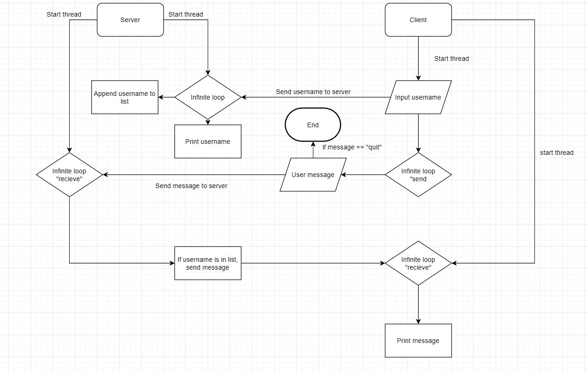

# Charbel's Messaging app T2A3

## Problem
The problem I have decided to tackle is that of communication. Instantaneous communication is of utmost importance in our society and it never hurts to have too many messaging apps.

## Solution
The best solution for this is two-way communication between a client and a server. Clients will sign on to a server which is located at a specific IP address enabling them to communicate with anyone that is also connected at the same time. The client will send a message which will be received by the server and passed on to all clients connected. Each client will have the ability to select a username so they can be easily identified.

## Input
As the app is currently in a basic state, the first input will come from the host when they first run "server.py". When opening through WSL the host will enter "python3 server.py *(Their IP Address)*". This is handled by the argparse module which will convert the command into a readable python string, and pass it into the first attribute of the Server class which is the host IP. The second attribute "port" is set to 1060 by default. The client will also have to enter the IP address they wish to connect to when opening their app which will be passed to the Client class.

On the clients side, They will then be prompted to enter a username and given a few welcome messages. This is handled by the "start" method within the Client class which will run when the program starts. An instance of the Send class is created within the Start class, "send", which will run right after. When a user typed a message, we use the ".sendall()" function to send that message back to the socket (which is binded to the servers IP and port in the server file). This is handled by an infinite while loop which will break if the user types "quit", closing their connection to the server.

## Output
While running the output from the Send class will be sent to the socket. This goes back to the server which has a class Serversock which is running on an infinite loop. This will recieve the message and decode into ascii format. Everytime a new connection joins their details are added to a list of connections. The server will send the message to all connections in that list using a for loop to iterate through each one.

## Flowchart

